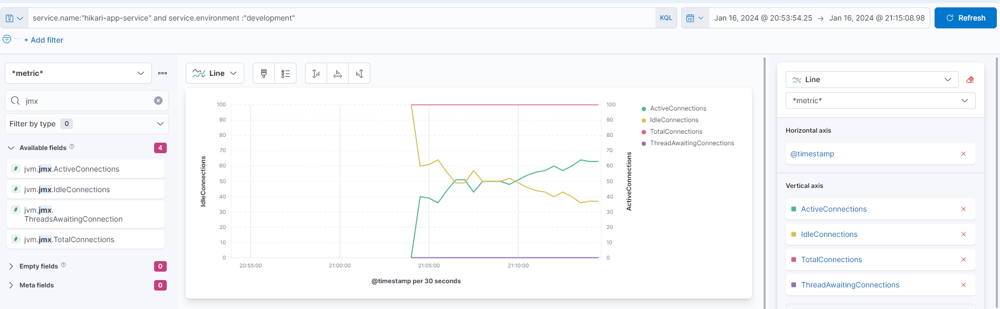

## How monitor database connection pool metrics with Elastic APM Agent
### Intro
Elastic APM such another APM tools provides monitoring and troubleshooting of application performance.
You can find more details about this here [link](https://www.elastic.co/blog/monitoring-java-applications-and-getting-started-with-the-elastic-apm-java-agent).

HikariCP is a reliable, high-performance Java connection pool. In general, connection pooling enhances database
performance by establishing and keeping a pool of connections live so that they can be reused whenever a connection
is needed, eliminating the overhead of initiating a new one.
Monitoring of the Hikari Connection Pool provides visibility into database connection management, allowing
systems to alert when things go wrong and helping developers understand how their systems are behaving under 
different loads.
HikariCP provides various metrics that allow for monitoring the health and performance of the connection pool. 

### Prerequisites

1. Create a simple spring application that you can find here
   [https://github.com/videnkz/blog-examples/hikari-app](https://github.com/videnkz/blog-examples/tree/master/hikari-app)

### Configure capturing Hikari Connection Pool metrics
   
1. List of available metrics that provides HikariCP you can find
[here] (https://github.com/brettwooldridge/HikariCP/wiki/MBean-(JMX)-Monitoring-and-Management).

- Idle Connection count
- Active Connections (in use)
- Total Connections
- The number of threads waiting for a connection

>  JMX (Java Management Extensions) is a Java technology that supplies tools for managing 
   and monitoring applications, system objects, devices, and service-oriented networks. 
   JMX can be used to monitor and manage both system-level and application-level entities. 
   These entities are represented by objects known as MBeans (Managed Beans).
   In the context of Java applications, Managed Beans (MBeans) are Java objects that 
   represent resources that you want to manage with JMX. Resources can include 
   application-specific entities or system services from the Java runtime such as 
   memory management and garbage collection. MBeans obtain and set resource properties, 
   perform operations on the managed resource, and emit notifications when changes occur.

2. Next, in order to use JMX for HikariCP, you need set the pool property - `registerMbeans=true`.
   In spring boot accordingly you need set `spring.datasource.hikari.register-mbeans` property with `true` value.

3. Elastic APM Agent Java provides a tool to capture JMX metrics with [configuration](https://www.elastic.co/guide/en/apm/agent/java/current/config-jmx.html#config-capture-jmx-metrics)

Here, you need define multiple comma separated JMX metric definitions

4. Now we need set metric definitions:

   `object_name[com.zaxxer.hikari:type=Pool (HikariPool-1)] attribute[IdleConnections] attribute[ActiveConnections] attribute[TotalConnections] attribute[ThreadsAwaitingConnection]`   
   
   - we set object_name with value `com.zaxxer.hikari:type=Pool (HikariPool-1)`.
     **If you have redefined pool name, you need change default `HikariPool-1` value with your pool name.**

5. Set environment variable `ELASTIC_APM_CAPTURE_JMX_METRICS` with value from previous step
6. In `blogs/composes/03_hikari_cp/docker-compose.yaml` provided our dockerized java service
   and postgresql.
   And in base compose file `blogs/composes/base/docker-compose.yaml` we run elasticsearch, kibana, apm-server.
7. Now we can up all our service with command below:
   ```
   docker-compose -f blogs/composes/base/docker-compose.yaml -f blogs/composes/03_hikari_cp/docker-compose.yaml up -d
   ```
8. Open kibana, go to `APM` tab and wait 5 min.
   Within 5 minutes, the `HelloGeneratorJob` class will make a lot of requests to postgresql.

9. Let's create a simple visualization    
   
   - With filter in `Search field names` enter `jmx`.
      It returns list of fields with name like `jvm.jmx.ActiveConnections, jvm.jmx.TotalConnections, jvm.jmx.IdleConnections, jvm.jmx.ThreadsAwaitingConnections` 
   - Select it all and drop to `Lens area`
   - Select `Line` as `Visualization type`
   - Rename the name of the metrics in the `Vertical axis` menu
   - In `Search` identify your service with sample requests
      `service.name:"hikari-app-service" and service.environment :"development" `
   - Now, you can watch how the connections are disposed of in HikariCP
   
     

### Summary

Monitoring HikariCP metrics with JMX and elastic-apm-agent provides you 
with increased visibility into your application's performance, allowing you to identify
and address issues more effectively.
